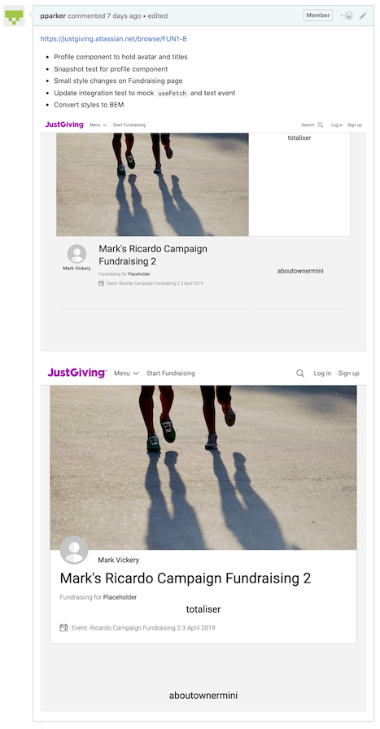

# JustGiving Fundraising Front-end Engineer Onboarding

Welcome! ¡Hola! Bonjour! Guten Tag!

This document aims to outlines some areas of interest and quick reference when onboarding as a front-end developer at Just Giving for the Fundraising team.

## 1. An introduction to Justgiving

#### Experiencing the platform as a user, to give context:

* There should be a copy of "JustGiving: Your complete guide" on your desk - gives you a flavour of how charities interact with the platform. Similar content online at https://pages.justgiving.com/charities.html
* To experience JG as a fundraiser, head to: https://www.dev.justgiving.com/ - you can safely set up fundraising pages and make test donations, without any money moving around and without charities being notified! More info: https://justgiving.atlassian.net/wiki/spaces/PAY/pages/46891039/Testing+Donations

#### Engineering onboarding:

* List of useful acronyms - https://justgiving.atlassian.net/wiki/spaces/PROD/pages/1382252564/JustGiving+Acroynms
* A new starter session should run in your first month - and this document is the detailed version of what is sumamrised in that session: https://justgiving.atlassian.net/wiki/spaces/CONSUMERTECH/pages/1667465238/New+starter+session

## 1. Slack groups

Useful groups to join:

* 111-fr-one-page
* 114-timeline
* all-justgiving
* front-end
* frontend-prs - NOTE: this is a private group, so you'll need to be invited by an existing member. Any front-ender can help.
* frontline
* fundraising - NOTE: this is a private group, so you'll need to be invited by an existing member. Any member of the FR team can help.
* fundraising-devs - NOTE: this is a private group, so you'll need to be invited by an existing member. Any member of the FR team can help.
* fundraising-support
* funtech - NOTE: this is a private group, so you'll need to be invited by an existing member. Any member of the FR/Fintech team can help. This is a joint channel for Fintech and Fundraising team - as we're both managed by Mark Vickery.
* graphql
* jg-developer-support
* jgtech
* offline
* releases
* stackoverflow
* tech-day
* ui-toolkit

## 2. Github

[Github](https://github.com/) is used as storage for work produced at JG. Work is split between [Github Enterprise](https://source.justgiving.com/) and [Github](https://github.com/JustGiving), with the aim of migrating old projects in Github Enterprise over to Github.

#### Common repositories

##### The Toolkit

[JG.FrontEnd.Toolkit](https://source.justgiving.com/JustGiving/JG.FrontEnd.Toolkit)

##### Fundraising One Page

[JG.Pages.UI](https://source.justgiving.com/JustGiving/JG.Pages.UI)

##### GraphQL

[JG.GraphQL](https://github.com/JustGiving/JG.GraphQL)

##### Fitness

[JG.Fitness](https://source.justgiving.com/JustGiving/JG.Fitness)

##### Campaign Creation

[JG.FrontEnd.CampaignsCreation](https://source.justgiving.com/JustGiving/JG.FrontEnd.CampaignsCreation)

#### Privileges

For both sites you will require admin privilages in order to see private repositories. Invitation links should be emailed to you. In the case that they aren't, speak to Tomasz Cudok.

#### PRs

Pull Requests are used to discuss and review new work that's been created for a project. A pull request is opened with the intention that the code within it, once approved, can be pulled into the main repository.

#### Pushing a branch to origin

When a branch is created locally, the changes within it first need to be staged locally, `git add -a -m "new commit message"`, and then pushed to the remote repository, `git push -u origin <branch-name>`.

#### Opening a PR

The changes can then be compared to a receiving branch and a PR can be opened. See [here](https://help.github.com/en/articles/creating-a-pull-request) for more info.

#### PR message

Make sure to be descriptive as possible in the PR message. A link to a relating JIRA ticket and small description of feature added/problem solved is useful. Additionally, for any front-end tasks, a screenshot of the change made is a good idea.



#### Approval

Before a PR can be merged, it first needs to be checked and approved by another member of the team. For front-end tickets, the PR can be added to the `frontend-prs` slack group, where a member of another team will pick it up. Otherwise, add the PR to the `fundraising-devs` slack group.

#### Merging

Once approved, you are free to merge your changes into master and delete your branch on origin.

## 3. CI/CD

Just Giving practises both [continuous integration](https://www.thoughtworks.com/continuous-integration) and [continuous delivery](https://continuousdelivery.com/). In order to merge a PR into master, it must first pass all code checks such as linting, unit testing and integration testing.

### Pipelines

[GOCD](https://www.gocd.org/) is used to run older project pipelines that deploy a project to certain stages. There are few different GOCD environments:

* https://gocd.hub.justgiving.service/go/pipelines
* https://deploy.prod.justgiving.service/go/pipelines

[CircleCI](https://circleci.com/) is planned to be used as the new CI/CD platform to deploy code. Currently, only GraphQL is deployed using CircleCI:
* https://circleci.com/gh/JustGiving

## 4. Sprints

The fundraising team practises the [Scrum methodology](https://www.atlassian.com/agile/scrum), working in 2 week sprints and undertaking sprint planning, sprint grooming, retrospective and demo ceremonies.

### Sprint board

A board hosting the current tickets for a sprint is used to organise the teams work. [Jira](https://justgiving.atlassian.net/secure/RapidBoard.jspa?rapidView=245) is used to manage this.

## 5. Toolkit

[The toolkit](https://source.justgiving.com/JustGiving/JG.FrontEnd.Toolkit) is a collection of ready made front-end components and styles that can be imported and used in projects. It currently has two style guides:

* [Storyboard](https://styleguide.dev.aws.justgiving.service)
* [Docz](https://design-system.dev.aws.justgiving.service)

Content is currently being migrated over from Storyboard to Docz, so if you are unable to find something be sure to check both.

_**Note:**_ The current OnePage project involves re-appraising some of these components, and rebuilding them rather than simply importing the existing version from the style guide.

## 6. Port mapping

Most repos require `local.justgiving.com` to be mapped to `127.0.0.1`. In the terminal, open your hosts file:

```bash
open /etc/hosts
```

And add to the end

```bash
127.0.0.1 local.justgiving.com
```

## 7. Cli

The cli is where you will spend a lot of your time, so it's useful to set this up in the best possible way. I recommend using [iterm 2](https://www.iterm2.com/).

### Z Shell

This is a personal opinion but [Z shell](https://github.com/robbyrussell/oh-my-zsh/wiki/Installing-ZSH) (or Zsh) is the most useful shell to have in your cli.

### Oh my ZSH

With Zsh you are also able to install [Oh my Zsh](https://github.com/robbyrussell/oh-my-zsh/), a framework for managing zsh configurations. Use this to make your terminal look like a computer out of nasa.

## 8. Software

Other useful software I recommend installing:

* [Firefox Developer Edition](https://www.mozilla.org/en-GB/firefox/developer/)
* [Docker](https://hub.docker.com/editions/community/docker-ce-desktop-mac)
* [GraphQL IDE](https://github.com/andev-software/graphql-ide/releases)
* [Postman](https://www.getpostman.com/downloads)
